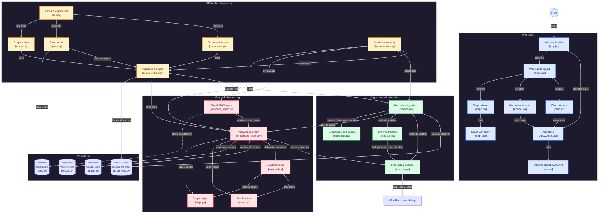

```mermaid
%% Generated by https://gitdiagram.com/thoyajmithra/neograph
%%{init: {'theme': 'redux-dark-color'}}%%
flowchart TD

subgraph group_client["Web client"]
  node_web_app["Web application<br/>[App.jsx]"]
  node_app_context["App state<br/>[AppContext.jsx]"]
  node_web_layout["Workspace layout<br/>[layout.jsx]"]
  node_chat_ui["Chat interface<br/>[chat.jsx]"]
  node_sidebar["Document sidebar<br/>[sidebar.jsx]"]
  node_graph_ui["Graph viewer<br/>[graph.jsx]"]
  node_web_api["Document and query API<br/>[api.jsx]"]
  node_graph_api["Graph API client<br/>[graph.jsx]"]
end

subgraph group_api["API and orchestration"]
  node_api_app["FastAPI application<br/>[app.py]"]
  node_document_routes["Document routes<br/>[documents.py]"]
  node_query_routes["Query route<br/>[query.py]"]
  node_graph_routes["Graph routes<br/>[graph.py]"]
  node_dependencies["Runtime assembly<br/>[dependencies.py]"]
  node_async_engine["Application engine<br/>[async_engine.py]"]
end

subgraph group_ingestion["Ingestion and extraction"]
  node_pipeline["Document ingestion<br/>[pipeline.py]"]
  node_extractor["Entity extraction<br/>[extractor.py]"]
  node_encoder["Embedding encoder<br/>[encoder.py]"]
  node_document_models["Documents and traces<br/>[document.py]"]
end

subgraph group_reasoning["Graph and reasoning"]
  node_reasoner["Graph RAG agent<br/>[reasoner_async.py]"]
  node_knowledge_graph["Knowledge graph<br/>[knowledge_graph.py]"]
  node_traversal["Graph traversal<br/>[traversal.py]"]
  node_node_model["Graph nodes<br/>[node.py]"]
  node_edge_model["Graph edges<br/>[edge.py]"]
end

subgraph group_persistence["Persistence"]
  node_document_store[("Document store<br/>[documents.py]")]
  node_chat_store[("Chat store<br/>[chat.py]")]
  node_graph_store[("Graph store<br/>[graph.py]")]
  node_vector_store[("Vector store<br/>[vector.py]")]
end

node_user(("User"))
node_cloud_embeddings["Cloudflare embeddings"]

node_user -.->|"uses"| node_web_app
node_web_app -->|"provides state"| node_app_context
node_web_app -->|"renders"| node_web_layout
node_web_layout -->|"renders"| node_chat_ui
node_web_layout -->|"renders"| node_sidebar
node_web_layout -->|"renders"| node_graph_ui
node_chat_ui -->|"uses state"| node_app_context
node_sidebar -->|"uses state"| node_app_context
node_app_context -->|"calls"| node_web_api
node_graph_ui -->|"calls"| node_graph_api
node_api_app -->|"registers"| node_document_routes
node_api_app -->|"registers"| node_query_routes
node_api_app -->|"registers"| node_graph_routes
node_document_routes -->|"calls"| node_async_engine
node_query_routes -->|"streams query"| node_async_engine
node_query_routes -->|"saves turn"| node_chat_store
node_graph_routes -->|"calls"| node_async_engine
node_dependencies -->|"constructs"| node_async_engine
node_dependencies -->|"constructs"| node_pipeline
node_dependencies -->|"constructs"| node_reasoner
node_dependencies -->|"loads"| node_knowledge_graph
node_async_engine -->|"ingests files"| node_pipeline
node_async_engine -->|"refreshes"| node_knowledge_graph
node_pipeline -->|"reads and writes"| node_document_store
node_pipeline -->|"embeds chunks"| node_encoder
node_pipeline -->|"extracts entities"| node_extractor
node_pipeline -->|"builds graph"| node_knowledge_graph
node_extractor -->|"deduplicates by embedding"| node_encoder
node_encoder -->|"requests vectors"| node_cloud_embeddings
node_reasoner -->|"retrieves and traces"| node_knowledge_graph
node_knowledge_graph -->|"embeds queries"| node_encoder
node_knowledge_graph -->|"delegates traversal"| node_traversal
node_knowledge_graph -->|"loads and persists"| node_graph_store
node_knowledge_graph -->|"searches vectors"| node_vector_store
node_knowledge_graph -->|"uses nodes"| node_node_model
node_knowledge_graph -->|"uses edges"| node_edge_model
node_traversal -->|"traverses"| node_node_model
node_traversal -->|"follows edges"| node_edge_model
node_pipeline -->|"creates document chunks"| node_document_models
node_async_engine -->|"lists and fetches"| node_document_store
node_reasoner -.->|"uses chat history"| node_chat_store

click node_web_app "https://github.com/thoyajmithra/neograph/blob/master/app/web/src/App.jsx"
click node_app_context "https://github.com/thoyajmithra/neograph/blob/master/app/web/src/context/AppContext.jsx"
click node_web_layout "https://github.com/thoyajmithra/neograph/blob/master/app/web/src/components/layout/layout.jsx"
click node_chat_ui "https://github.com/thoyajmithra/neograph/blob/master/app/web/src/components/chat/chat.jsx"
click node_sidebar "https://github.com/thoyajmithra/neograph/blob/master/app/web/src/components/sidebar/sidebar.jsx"
click node_graph_ui "https://github.com/thoyajmithra/neograph/blob/master/app/web/src/components/graph/graph.jsx"
click node_web_api "https://github.com/thoyajmithra/neograph/blob/master/app/web/src/api/api.jsx"
click node_graph_api "https://github.com/thoyajmithra/neograph/blob/master/app/web/src/api/graph.jsx"
click node_api_app "https://github.com/thoyajmithra/neograph/blob/master/app/api/app.py"
click node_document_routes "https://github.com/thoyajmithra/neograph/blob/master/app/api/api/routes/documents.py"
click node_query_routes "https://github.com/thoyajmithra/neograph/blob/master/app/api/api/routes/query.py"
click node_graph_routes "https://github.com/thoyajmithra/neograph/blob/master/app/api/api/routes/graph.py"
click node_dependencies "https://github.com/thoyajmithra/neograph/blob/master/app/api/dependencies.py"
click node_async_engine "https://github.com/thoyajmithra/neograph/blob/master/app/api/core/async_engine.py"
click node_pipeline "https://github.com/thoyajmithra/neograph/blob/master/engine/ingestion/pipeline.py"
click node_extractor "https://github.com/thoyajmithra/neograph/blob/master/engine/extraction/extractor.py"
click node_encoder "https://github.com/thoyajmithra/neograph/blob/master/engine/embedding/encoder.py"
click node_reasoner "https://github.com/thoyajmithra/neograph/blob/master/engine/agent/reasoner_async.py"
click node_knowledge_graph "https://github.com/thoyajmithra/neograph/blob/master/engine/graph/knowledge_graph.py"
click node_traversal "https://github.com/thoyajmithra/neograph/blob/master/engine/graph/traversal.py"
click node_document_models "https://github.com/thoyajmithra/neograph/blob/master/engine/models/document.py"
click node_node_model "https://github.com/thoyajmithra/neograph/blob/master/engine/models/node.py"
click node_edge_model "https://github.com/thoyajmithra/neograph/blob/master/engine/models/edge.py"
click node_document_store "https://github.com/thoyajmithra/neograph/blob/master/storage/postgres/documents.py"
click node_chat_store "https://github.com/thoyajmithra/neograph/blob/master/storage/postgres/chat.py"
click node_graph_store "https://github.com/thoyajmithra/neograph/blob/master/storage/postgres/graph.py"
click node_vector_store "https://github.com/thoyajmithra/neograph/blob/master/storage/postgres/vector.py"

classDef toneNeutral fill:#f8fafc,stroke:#334155,stroke-width:1.5px,color:#0f172a
classDef toneBlue fill:#dbeafe,stroke:#2563eb,stroke-width:1.5px,color:#172554
classDef toneAmber fill:#fef3c7,stroke:#d97706,stroke-width:1.5px,color:#78350f
classDef toneMint fill:#dcfce7,stroke:#16a34a,stroke-width:1.5px,color:#14532d
classDef toneRose fill:#ffe4e6,stroke:#e11d48,stroke-width:1.5px,color:#881337
classDef toneIndigo fill:#e0e7ff,stroke:#4f46e5,stroke-width:1.5px,color:#312e81
classDef toneTeal fill:#ccfbf1,stroke:#0f766e,stroke-width:1.5px,color:#134e4a
class node_web_app,node_app_context,node_web_layout,node_chat_ui,node_sidebar,node_graph_ui,node_web_api,node_graph_api,node_user toneBlue
class node_api_app,node_document_routes,node_query_routes,node_graph_routes,node_dependencies,node_async_engine toneAmber
class node_pipeline,node_extractor,node_encoder,node_document_models toneMint
class node_reasoner,node_knowledge_graph,node_traversal,node_node_model,node_edge_model toneRose
class node_document_store,node_chat_store,node_graph_store,node_vector_store,node_cloud_embeddings toneIndigo
```

